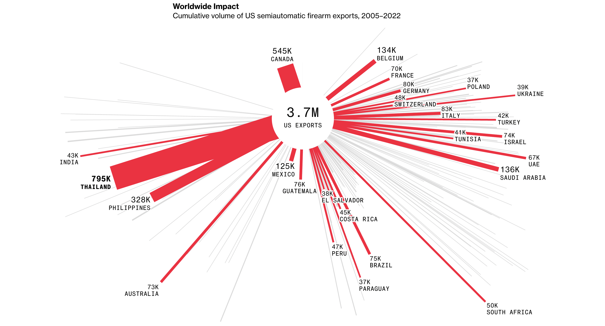

| [home page](https://ghulepati.github.io/ghule-portfolio/) | [visualizing debt](tableau.md) | | [US Guns Export](Export.md) | 

## Step 1 - Process of Data Selection 

The following article has been accessed from  [makeovermonday](https://makeovermonday.co.uk/)  for this assignment 

---
**Citation**

Cannon, Christopher. “Mass US-Made Gun Exports Are Fueling Violence, Shootings Globally.” Bloomberg, 24 July 2023, https://www.bloomberg.com/graphics/2023-us-made-gun-exports-shootings-violence-sig-sauer/. Accessed 18 September 2024.

---
- Locating the Dataset from [United States Census Bureau](https://www.census.gov/foreign-trade/data/index.html)
  After trying to locate the data set from this website, I couldn't somehow find the correct dataset, so after trying this for a while I tried for alternative sources.
- Locating the Dataset from an existing public Tableau visualization
  Even this method did not work out as the tableau visualisation was downloadable but the dataset wasn't.
- Creating an account on [Data World](https://data.world.com) and then downloading the dataset from there
  I created a student account using my andrew id and I was able to download the dataset from here.

### Why this Dataset ?
I was going through various datasets on [makeovermonday](https://makeovermonday.co.uk/)  when I first started re-designing for Energy Consumption by source visualization. I was half way done through my final design when I realised that I don't feel like this is something I want to do. I went back to the list of topics and them saw this, US arms export and though it took me some time to find the right data for it, it felt like something important to work on. When I first looked at this visualisation I was shocked as Thailand imports the highest arms from the US, and couldn't stop myself from further looking into the details of crimes caused directly or indirectly from the US arms import. I think that this is a case of causation, arms export from US is what causing increase in number of crimes in countries like Canada and Thailand, and even my own country India. When I looked at the visualisation, I noticed that some lines are longer, some are shorter and then width also varies not giving a complete picture of the size of the country vs it's arms import which I feel is really important. I choose this dataset as feel like, if a visualisation on a serious concerning topic like arms export could be made simpler for everyone to understand, it might help in reducing arms manufacturing and export. 

## Step 2 - Data Visualization Critique

### Usefulness - 
#### Rating (9/10)
The visualization effectively shows the increase in US semiautomatic gun exports over time, which is highly relevant to the article's focus on the rise of American gun exports and their global impact. 

### Completeness - 
#### Rating (7/10)
The visualization is complete in a lot of sense as in it has just the right amount of information and not too much, but I think what it lacks is size of the countries as well. As I think it is really important to understand the size of the country in terms of area and population vs the arms imported. 

### Perceptibility - 
#### Rating (3/10)
The visualization struggles to clearly convey its message within the first few seconds of viewing. The varying thickness of the lines, representing the volume of exports, is not immediately apparent or easily interpretable. While the use of red color draws attention, the overall design fails to effectively communicate the relationship between line thickness, length, and the data they represent.

### Intuitiveness - 
#### Rating (3/10)
The chart's design is not readily understood by a general audience. The meaning of the line thickness and its correlation with export volumes is not immediately clear, requiring additional explanation. This lack of intuitive design hinders quick comprehension of the data's significance.

### Aesthetics - 
#### Rating (9/10)
The visualisation is beautiful to look at. The use of red color and the arms count mentioned at the tip of each stroke does give it a visually appealing aesthetic look.

### Truthfulness - 
#### Rating(6/10)
While the data sources are clearly labeled, the representation of export volumes through line thickness may not accurately reflect the precise values, potentially leading to misinterpretation. The lack of clear scale for the thickness of the lines could result in viewers misunderstanding the true magnitude of the changes in export volumes.

## Step 3 - Redesign 

<noscript></noscript><object class='tableauViz'  style='display:none;'><param name='host_url' value='https%3A%2F%2Fpublic.tableau.com%2F' /> <param name='embed_code_version' value='3' /> <param name='site_root' value='' /><param name='name' value='TreeGraph-CummulativeVolofFirearmsExportedbytheUS&#47;Sheet1' /><param name='tabs' value='no' /><param name='toolbar' value='yes' /><param name='static_image' value='https:&#47;&#47;public.tableau.com&#47;static&#47;images&#47;Tr&#47;TreeGraph-CummulativeVolofFirearmsExportedbytheUS&#47;Sheet1&#47;1.png' /> <param name='animate_transition' value='yes' /><param name='display_static_image' value='yes' /><param name='display_spinner' value='yes' /><param name='display_overlay' value='yes' /><param name='display_count' value='yes' /><param name='language' value='en-US' /></object>
                

## Step 4 - Interviews

### Interview 1 
---
**Undergraduate Student**

   - **Can you tell me what do you see in the first 10 seconds when you see this visualization?**
     I see Red color, country names espcially Thailand
    I also see this has something to do with US arms export.
    
  - **Can you please describe what do you understand from this visualisation?**
    I think that Thailand has the most area and a prominent red color so it has the highest amount of imports from the US
    Size of the areas represent the volume of export and the color might represent something like top 3 countries or so.
    
  - **What particularly helped you understand the visualisation?**
    I think that title is self-explanatory. I also feel that the color scale is decent, as in red is a dominant color and thus it catches the eye
    I like the simplicity of the visualisation.
    
  - **What do you think should be improved?**
    This visualisation gives a feeling that Thailand is a huge country when it is not. It is a small country in terms of area whereas Canada is a pretty huge country.
    Probably a Map might help better in this aspect, just to see the size of the country vs it's import of arms

---
### Interview 2  
---
**Working Professional**

   - **Can you tell me what do you see in the first 10 seconds when you see this visualization?**
     I see Red color, country names espcially Thailand
    I also see this has something to do with US arms export.
    
  - **Can you please describe what do you understand from this visualisation?**
    I think that Thailand has the most area and a prominent red color so it has the highest amount of imports from the US
    Size of the areas represent the volume of export and the color might represent something like top 3 countries or so.
    
  - **What particularly helped you understand the visualisation?**
    I think that title is self-explanatory. I also feel that the color scale is decent, as in red is a dominant color and thus it catches the eye
    I like the simplicity of the visualisation.
    
  - **What do you think should be improved?**
    This visualisation gives a feeling that Thailand is a huge country when it is not. It is a small country in terms of area whereas Canada is a pretty huge country.
    Probably a Map might help better in this aspect, just to see the size of the country vs it's import of arms

---

## Step 5 - Final Design 

<noscript></noscript><object class='tableauViz'  style='display:none;'><param name='host_url' value='https%3A%2F%2Fpublic.tableau.com%2F' /> <param name='embed_code_version' value='3' /> <param name='path' value='shared&#47;2RHXK34WQ' /> <param name='toolbar' value='yes' /><param name='static_image' value='https:&#47;&#47;public.tableau.com&#47;static&#47;images&#47;2R&#47;2RHXK34WQ&#47;1.png' /> <param name='animate_transition' value='yes' /><param name='display_static_image' value='yes' /><param name='display_spinner' value='yes' /><param name='display_overlay' value='yes' /><param name='display_count' value='yes' /><param name='language' value='en-US' /><param name='filter' value='publish=yes' /></object>
                

