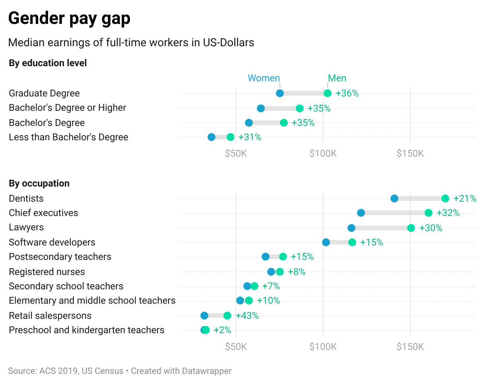

| [home page](https://ghulepati.github.io/ghule-portfolio/) | [visualizing debt](tableau.md) | | [US Guns Export](Export.md) | [Final Project Part I](https://ghulepati.github.io/ghule-portfolio/final_project_SaiGhule.html)| [Final Project Part II](https://ghulepati.github.io/ghule-portfolio/Final_Project_SaiGhule_Part_II.html) |

# Wireframes / storyboards

### Introduction -  The Privilege Perspective
Personal reflection on educational and social advantages
Acknowledging the bubble of privilege

### Progress in Women's Leadership
Rise of women in business
Visualization -  Increase in Women Leaders in Business

<noscript></noscript><object class='tableauViz'  style='display:none;'><param name='host_url' value='https%3A%2F%2Fpublic.tableau.com%2F' /> <param name='embed_code_version' value='3' /> <param name='site_root' value='' /><param name='name' value='IncreaseinNumberofFemaleBusinessDirectors&#47;Sheet1' /><param name='tabs' value='no' /><param name='toolbar' value='yes' /><param name='static_image' value='https:&#47;&#47;public.tableau.com&#47;static&#47;images&#47;In&#47;IncreaseinNumberofFemaleBusinessDirectors&#47;Sheet1&#47;1.png' /> <param name='animate_transition' value='yes' /><param name='display_static_image' value='yes' /><param name='display_spinner' value='yes' /><param name='display_overlay' value='yes' /><param name='display_count' value='yes' /><param name='language' value='en-US' /><param name='filter' value='publish=yes' /></object>
                

### Persistent Inequalities
Wage gap analysis
Underrepresentation in certain industries

Visualization - Gender pay gap across states in US and in education

This visualization is created with the help of Datawrapper using it's inbuilt dataset. 
Datawrapper: Create charts, maps, and tables, https://www.datawrapper.de/. Accessed 24 September 2024.

### Education and Empowerment
Higher teen birth rates maybe an indicator of lack of proper education and sexual health resources.

Visualization: Teen birth rates in the US by state

<noscript></noscript><object class='tableauViz'  style='display:none;'><param name='host_url' value='https%3A%2F%2Fpublic.tableau.com%2F' /> <param name='embed_code_version' value='3' /> <param name='site_root' value='' /><param name='name' value='TeenBirthRates_17280073261100&#47;Sheet1' /><param name='tabs' value='no' /><param name='toolbar' value='yes' /><param name='static_image' value='https:&#47;&#47;public.tableau.com&#47;static&#47;images&#47;Te&#47;TeenBirthRates_17280073261100&#47;Sheet1&#47;1.png' /> <param name='animate_transition' value='yes' /><param name='display_static_image' value='yes' /><param name='display_spinner' value='yes' /><param name='display_overlay' value='yes' /><param name='display_count' value='yes' /><param name='language' value='en-US' /><param name='filter' value='publish=yes' /></object>
                

### Looking Ahead - Challenges and Opportunities
Key areas for improvement
Role of policy, education, and cultural change
I plan to have three boxes, one with opportunities one with challenges and the middle one with a unique question with directs to our call of action.

### Conclusion - Inspiring Action
Recap of key insights
Encouraging critical thinking and personal reflection
Giving a sense of what it is to be a woman in 2024

# User research 

## Target audience

My target audience is my class professor, my class TA, my flatmate, my boyfriend, my mother who is always wishes for my well being, my father who calms her down, the woman for whom I opened the door today, the nice gentleman who said I looked beautiful in the morning, the not so nice person who thought I couldn't do xyz, the person who always believed in me even when I didn't. Yes, this list includes everyone, every human irrespective of their genders and sexual preferences around me and around all of us, as I think that being a woman, this beautiful rollercoaster journey is incomplete without everyone around us. The purpose of this story is not to point out at organizations or people who have themselves done for example gender pay discrimination or were victimes of, this is simply to educate people of the current scenario and making them think on their own if they want to do anything about it. 

## Interview script

❓ What do you understand by the title of this project? Can you guess the story structure from the title or does it leave you with various 
   different possibilities for this story?
   
❓ What is being a 21st century woman according to you?

❓ Are the visualizations easy to understand? If I give you 10 seconds per visualization, what all will you remember from them collectively? 
   Does it form a story structure in your head?
   
❓ If you were to explain what being a woman in this world is to a child, will this story work for the purpose? Does it cover various aspects 
   of being a woman without getting into extremes?

❓ What improvements will you suggest (Graphs, Design, Colors, Text)? What should the call of action be in the end according to you?  

## Interview findings
Interview 1 - A Female's Perspective 

❓ What do you understand by the title of this project? Can you guess the story structure from the title or does it leave you with various 
  different possibilities for this story?
  
**Answer**   

Just by looking at the title, I can think of a few different things that the project could potentially talk about but it seems relatively broad and open. This seems like a good thing because it makes me think that there will be a few different elements captured in the story about Gen Z women and their life.

   
❓ What is being a 21st century woman according to you?

**Answer**  

Being a 21st-century woman to me, means having the freedom to make my own choices—whether it's about my career, education, or personal life. It's about finding balance between ambition and self-care, standing up for equality, and staying true to my values. It’s also about adapting to the fast-changing world while making sure I grow personally and professionally.

❓ Are the visualizations easy to understand? If I give you 10 seconds per visualization, what all will you remember from them collectively? 
   Does it form a story structure in your head?

**Answer**  

Yes, the visualizations are overall intuitive and easy to understand. I think they do a good job of communicating the story that you are trying to communicate. A couple that stood out to me were Increase in female enrollment in Schools and Gender pay gap. However, I didn’t easily get the Increase in Female Business Directors chart. Not sure how much I can retain in just 10 seconds because I also found myself trying to understand if this graph was for or against the idea (as in which stance was it taking).

   

❓ If you were to explain what being a woman in this world is to a child, will this story work for the purpose? Does it cover various aspects 
   of being a woman without getting into extremes?

**Answer**  

I think there are parts of this story that could be communicated easily to a child like the increase in female enrollment in schools. But there are more challenging concepts like gender pay gap that a child might not necessarily understand.

❓ What improvements will you suggest (Graphs, Design, Colors, Text)? What should the call of action be in the end according to you?  

**Answer**  

I would suggest looking more into how women are performing in particular fields and the growth rate. That could be interesting to look at. The call to action right now seems to just be understanding the story about women’s empowerment which makes sense to me.

### Interview 3 - A Man's Perspective 

❓ What do you understand by the title of this project? Can you guess the story structure from the title or does it leave you with various 
  different possibilities for this story?
  
**Answer**   

By title, I thought of it to be a patronizing article which is highly circulated on social media. Due to this perception, I started thinking about story structure but it was quite different from the actual content

   
❓ What is being a 21st century woman according to you?

**Answer**  

Independent being who does not require permission for anything, is career driven and financially independent as well.

❓ Are the visualizations easy to understand? If I give you 10 seconds per visualization, what all will you remember from them collectively? 
   Does it form a story structure in your head?

**Answer**  

   I think they give an overarching idea of how slowly facilities and gaps between the genders have reduced.

   

❓ If you were to explain what being a woman in this world is to a child, will this story work for the purpose? Does it cover various aspects 
   of being a woman without getting into extremes?

**Answer**  

   A child understands stories, pictures, more simpler language. So I would focus on making it more easily digestible for children.

❓ What improvements will you suggest (Graphs, Design, Colors, Text)? What should the call of action be in the end according to you?  

**Answer**  

Text could be lesser. Overall, binding the entire narrative in form of story would be much more eye opening instead of just presenting facts and numbers. Facts appeal to a human brain but story appeals to a human heart and hence it is definitely much more remembered as well. 
Call to action should be dependent on the goal. If the goal is to create awareness, then it could be something like 

"Try imagining yourself to be a woman in this century as it will help you learn how to behave with one"

### Interview 2 - A Man's Perspective 

❓ What do you understand by the title of this project? Can you guess the story structure from the title or does it leave you with various 
  different possibilities for this story?
  
**Answer**   

The title suggests the experiences and perspectives of a woman in the 21st century. The story would likely highlight themes such as empowerment, challenges & progress. The project weaves together personal anecdotes, statistical data, and general cultural observations.

   
❓ What is being a 21st century woman according to you?

**Answer**  

Women today often balance multiple roles, including professional, family, and personal lives. Despite significant advances in our society, women today confront issues such as gender inequality, societal expectations, and the ever-expanding struggle for work-life balance. 

❓ Are the visualizations easy to understand? If I give you 10 seconds per visualization, what all will you remember from them collectively? 
   Does it form a story structure in your head?

**Answer**  

   A 21st-century woman embodies resilience, adaptability, and a commitment to forging her own path while contributing to broader social change.
The visualizations have colorful visuals, clear labels, and key data points that are clearly represented. These visualizations build upon each other to comprehensively tell the overarching story of the project.

   

❓ If you were to explain what being a woman in this world is to a child, will this story work for the purpose? Does it cover various aspects 
   of being a woman without getting into extremes?

**Answer**  

   Yes, the story is suitable to explain to a child what it means to be a woman in today's world. Themes such as pursuing dreams, overcoming challenges, and contributing positively to society at large. The story conveys the essence of being a woman without getting into extreme or inappropriate topics for children.

❓ What improvements will you suggest (Graphs, Design, Colors, Text)? What should the call of action be in the end according to you?  

**Answer**  

Graphs - Incorporate interactive graphs/visuals to further engage the audience in an interactable format.
Design - Balance the layout slightly better by utilizing the space available, to convey the maximum amount of data

The call to action should be to inspire the audience to interact with the topic on a deeper, more personal level. It should encourage everyone to promote initiatives such as gender equality and help enlighten the audience on women's issues, written by a woman. The call to action should inspire the reader to be more aware of the interactions around them and to be a force for good in this world.

# Identified changes for Part III

