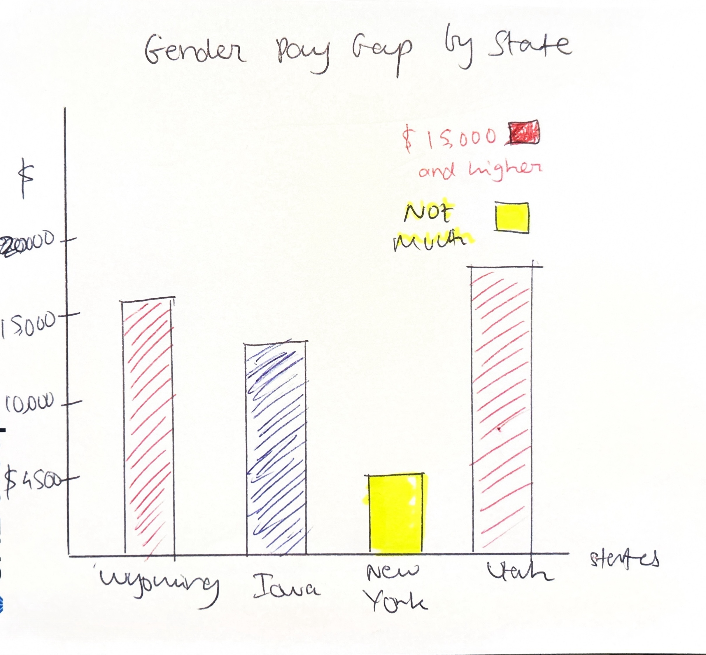

| [home page](https://ghulepati.github.io/ghule-portfolio/) | [visualizing debt](tableau.md) | | [US Guns Export](Export.md) | [Final Project](https://ghulepati.github.io/ghule-portfolio/final_project_SaiGhule.html)|

# Living in the era of Gen-Z women?
# Summary of Project

As a woman from a well-educated family who has always provided me with the best opportunities, I've been reflecting on women's empowerment in the 21st century. My circle of female friends consists of high achievers who continue to make significant strides in their lives. While I'm amazed by how much women's leadership has grown in recent years, I can't help but feel that privileged women like myself - and yes, I acknowledge my privilege - often live in a bubble. We sometimes assume that all women have the same rights and opportunities we do.

The truth is, in the 21st century, while women theoretically have equal rights, not all have the option to exercise them. I want to explore this disparity, but not to spark a debate on women's rights or to question political opinions and unjust laws (though I'm tempted to). My goal is simpler - I want to present a few visualizations, both positive and negative, to offer a glimpse into what it means to be a woman in the 21st century.

I'm not trying to pit women against the world or start a heated discussion. Instead, I want to educate my audience and encourage them to think. I believe it's crucial to show both the progress we've made and the challenges that persist, especially for women who don't share the privileges I've been fortunate to have. I want my audience to walk away with a more nuanced understanding of women's status globally. I hope to inspire them to consider how they might contribute to furthering gender equality in their own spheres of influence.

My hope is that by presenting a balanced view - acknowledging both the progress we've made and the challenges that remain - I can create a thoughtful, educational presentation. I want to avoid controversy while still encouraging meaningful reflection on what it means to be a woman in the 21st century.

Ultimately, I want my audience to leave with a deeper understanding of the complexities surrounding women's rights and empowerment. I hope to inspire them to think critically about these issues and consider how they might contribute to positive change, regardless of their own background or circumstances.

# Project Outline

As one can see in the story arc, I want to start my story by positive changes happening in the society and around the world for women empowerment. To show this I will use the following visualizations - 

### Introduction -  The Privilege Perspective
Personal reflection on educational and social advantages
Acknowledging the bubble of privilege

### Progress in Women's Leadership
Rise of women in business
Increasing female enrollment in primary schools
Visualization -  Trends in women's leadership positions and primary school enrollment rates

### The Labor Force Landscape
Historical context of women in the workforce
Current state of women's labor force participation
Visualization - Women's labor force participation rates by region and over time

### Persistent Inequalities
Wage gap analysis
Underrepresentation in certain industries
Visualization - Gender pay gap across states in US and in education

### Education and Empowerment
Correlation between education and other empowerment indicators
Impact of early motherhood on opportunities
Visualization: Education access rates alongside labor force participation and teen birth rates

### Looking Ahead - Challenges and Opportunities
Key areas for improvement
Role of policy, education, and cultural change

### Conclusion - Inspiring Action
Recap of key insights
Encouraging critical thinking and personal reflection
Giving a sense of what it is to be a woman in 2024

# Initial Sketches

All sources of data for sketches are mentioned in the Data Section. 

## Increase in female enrollment in Schools

 

## Increase in Female Business Directors

<noscript></noscript><object class='tableauViz'  style='display:none;'><param name='host_url' value='https%3A%2F%2Fpublic.tableau.com%2F' /> <param name='embed_code_version' value='3' /> <param name='site_root' value='' /><param name='name' value='IncreaseinNumberofFemaleBusinessDirectors&#47;Sheet1' /><param name='tabs' value='no' /><param name='toolbar' value='yes' /><param name='static_image' value='https:&#47;&#47;public.tableau.com&#47;static&#47;images&#47;In&#47;IncreaseinNumberofFemaleBusinessDirectors&#47;Sheet1&#47;1.png' /> <param name='animate_transition' value='yes' /><param name='display_static_image' value='yes' /><param name='display_spinner' value='yes' /><param name='display_overlay' value='yes' /><param name='display_count' value='yes' /><param name='language' value='en-US' /><param name='filter' value='publish=yes' /></object>
                

### Gender Pay Gap by State

### Gender Pay Gap by Profession

This visualization is created with the help of Datawrapper using it's inbuilt dataset. 
Datawrapper: Create charts, maps, and tables, https://www.datawrapper.de/. Accessed 24 September 2024.

I plan to have either a video or an interactive visualization for teen birth rates and women rights, not sure if it is a political topic hence haven't included the visualization here. 

# Data Sources and Explanation

Following are the data sources which I have used/ I plan to use as a part of my final project. 

### Women in Household 

The home is often where gender roles are first defined and reinforced. By examining data on women's roles in households, we can uncover the root of many gender disparities. This dataset allows us to tell the story of how women's domestic responsibilities often form an "invisible second shift" that impacts their ability to pursue education, careers, and leadership roles. It also helps us highlight how changing household dynamics reflect broader societal shifts towards gender equality.

Reason - This data forms the foundation of our narrative, showing how the personal becomes political in the journey of women's empowerment.
| [Women in Household](https://data.unwomen.org/data-portal/sdm?annex=Household%20Composition%20and%20Living%20Arrangements&finic%5B%5D=P-13&finic%5B%5D=P-15&finic%5B%5D=P-17&finic%5B%5D=P-19&finic%5B%5D=P-20&finic%5B%5D=P-34&finic%5B%5D=P-35&finic%5B%5D=P-37&flocat%5B%5D=4&flocat%5B%5D=50&flocat%5B%5D=356&flocat%5B%5D=364&flocat%5B%5D=462&flocat%5B%5D=524&flocat%5B%5D=586&flocat%5B%5D=51&flocat%5B%5D=275&flocat%5B%5D=400&flocat%5B%5D=887&flocat%5B%5D=104&flocat%5B%5D=116&flocat%5B%5D=360&flocat%5B%5D=608&flocat%5B%5D=626&flocat%5B%5D=704&flocat%5B%5D=156&flocat%5B%5D=417&flocat%5B%5D=762&flocat%5B%5D=8&flocat%5B%5D=620&flocat%5B%5D=300&flocat%5B%5D=112&flocat%5B%5D=642&flocat%5B%5D=804&flocat%5B%5D=348&flocat%5B%5D=372&flocat%5B%5D=250&flocat%5B%5D=24&flocat%5B%5D=120&flocat%5B%5D=148&flocat%5B%5D=180&flocat%5B%5D=266&flocat%5B%5D=678&flocat%5B%5D=72&flocat%5B%5D=426&flocat%5B%5D=516&flocat%5B%5D=710&flocat%5B%5D=748&flocat%5B%5D=108&flocat%5B%5D=174&flocat%5B%5D=231&flocat%5B%5D=404&flocat%5B%5D=450&flocat%5B%5D=454&flocat%5B%5D=508&flocat%5B%5D=646&flocat%5B%5D=716&flocat%5B%5D=728&flocat%5B%5D=800&flocat%5B%5D=834&flocat%5B%5D=894&flocat%5B%5D=178&flocat%5B%5D=204&flocat%5B%5D=270&flocat%5B%5D=288&flocat%5B%5D=324&flocat%5B%5D=384&flocat%5B%5D=430&flocat%5B%5D=466&flocat%5B%5D=562&flocat%5B%5D=566&flocat%5B%5D=686&flocat%5B%5D=694&flocat%5B%5D=768&flocat%5B%5D=854&flocat%5B%5D=729&flocat%5B%5D=818&flocat%5B%5D=32&flocat%5B%5D=68&flocat%5B%5D=76&flocat%5B%5D=170&flocat%5B%5D=218&flocat%5B%5D=328&flocat%5B%5D=604&flocat%5B%5D=858&flocat%5B%5D=188&flocat%5B%5D=222&flocat%5B%5D=320&flocat%5B%5D=340&flocat%5B%5D=484&flocat%5B%5D=591&flocat%5B%5D=214&flocat%5B%5D=332&flocat%5B%5D=630&flocat%5B%5D=780&flocat%5B%5D=124&flocat%5B%5D=840&flocat%5B%5D=242&flocat%5B%5D=62&flocat%5B%5D=753&flocat%5B%5D=513&flocat%5B%5D=419&flocat%5B%5D=747&flocat%5B%5D=543&flocat%5B%5D=202&tab=table) |

“Data.” UN Women Data Hub, https://data.unwomen.org/data-portal. Accessed 24 September 2024.

### Women in Labour Force 
The story of women in the workforce is one of persistent progress and lingering challenges. This dataset allows us to paint a picture of women breaking barriers, entering traditionally male-dominated fields, and rising to leadership positions. At the same time, it reveals ongoing struggles with underemployment, occupational segregation, and work-life balance.

Reason - By tracking women's participation in the labor force over time and across countries, we can illustrate both how far we've come and how far we still have to go.
| [Women in Labour Force](https://data.unwomen.org/data-portal/sdm?annex=Labour%20Force%20Participation%20rates%20by%20Sex%20and%20Marital%20Status&finic%5B%5D=P-38&fimsc%5BP-38%5D%5B%5D=All&fimsc%5BP-38%5D%5B%5D=Widowed&fimsc%5BP-38%5D%5B%5D=Currently%20divorced%20or%20separated&fimsc%5BP-38%5D%5B%5D=Married%2Fin%20union&fimsc%5BP-38%5D%5B%5D=Single%2Fnever%20married&flocat%5B%5D=4&flocat%5B%5D=50&flocat%5B%5D=144&flocat%5B%5D=356&flocat%5B%5D=462&flocat%5B%5D=524&flocat%5B%5D=586&flocat%5B%5D=51&flocat%5B%5D=368&flocat%5B%5D=784&flocat%5B%5D=792&flocat%5B%5D=887&flocat%5B%5D=96&flocat%5B%5D=104&flocat%5B%5D=116&flocat%5B%5D=360&flocat%5B%5D=418&flocat%5B%5D=608&flocat%5B%5D=626&flocat%5B%5D=704&flocat%5B%5D=764&flocat%5B%5D=156&flocat%5B%5D=410&flocat%5B%5D=496&flocat%5B%5D=762&flocat%5B%5D=8&flocat%5B%5D=70&flocat%5B%5D=380&flocat%5B%5D=620&flocat%5B%5D=688&flocat%5B%5D=724&flocat%5B%5D=40&flocat%5B%5D=250&flocat%5B%5D=276&flocat%5B%5D=442&flocat%5B%5D=528&flocat%5B%5D=756&flocat%5B%5D=203&flocat%5B%5D=616&flocat%5B%5D=643&flocat%5B%5D=703&flocat%5B%5D=208&flocat%5B%5D=233&flocat%5B%5D=246&flocat%5B%5D=826&flocat%5B%5D=32&flocat%5B%5D=68&flocat%5B%5D=76&flocat%5B%5D=152&flocat%5B%5D=170&flocat%5B%5D=218&flocat%5B%5D=328&flocat%5B%5D=600&flocat%5B%5D=604&flocat%5B%5D=858&flocat%5B%5D=862&flocat%5B%5D=188&flocat%5B%5D=222&flocat%5B%5D=320&flocat%5B%5D=340&flocat%5B%5D=484&flocat%5B%5D=558&flocat%5B%5D=591&flocat%5B%5D=214&flocat%5B%5D=780&flocat%5B%5D=124&flocat%5B%5D=840&flocat%5B%5D=36&flocat%5B%5D=90&flocat%5B%5D=242&flocat%5B%5D=598&flocat%5B%5D=184&flocat%5B%5D=798&flocat%5B%5D=882&flocat%5B%5D=520&flocat%5B%5D=583&flocat%5B%5D=585&flocat%5B%5D=72&flocat%5B%5D=516&flocat%5B%5D=710&flocat%5B%5D=748&flocat%5B%5D=108&flocat%5B%5D=231&flocat%5B%5D=450&flocat%5B%5D=454&flocat%5B%5D=480&flocat%5B%5D=508&flocat%5B%5D=646&flocat%5B%5D=690&flocat%5B%5D=716&flocat%5B%5D=834&flocat%5B%5D=894&flocat%5B%5D=120&flocat%5B%5D=180&flocat%5B%5D=132&flocat%5B%5D=270&flocat%5B%5D=288&flocat%5B%5D=384&flocat%5B%5D=430&flocat%5B%5D=466&flocat%5B%5D=478&flocat%5B%5D=562&flocat%5B%5D=566&flocat%5B%5D=686&flocat%5B%5D=694&flocat%5B%5D=768&flocat%5B%5D=854&flocat%5B%5D=788&flocat%5B%5D=818&flocat%5B%5D=53&flocat%5B%5D=62&flocat%5B%5D=753&flocat%5B%5D=513&flocat%5B%5D=419&flocat%5B%5D=747&flocat%5B%5D=543&flocat%5B%5D=202&fgende%5BFemale%5D=Female&fgende%5BMale%5D=Male&tab=table) |

“Data.” UN Women Data Hub, https://data.unwomen.org/data-portal. Accessed 24 September 2024.

### Job Opportunities for Minority Women In Private Jobs  
This dataset allows us to delve into the intersectionality of gender and race in the workplace. It helps us tell the often-overlooked stories of minority women who face compounded challenges in their professional lives. By focusing on private sector jobs, we can examine how corporate policies and cultures impact diversity and inclusion.

Reason - This data adds depth to our narrative by highlighting that the experience of "women" is not monolithic, and that race and ethnicity play crucial roles in shaping opportunities and obstacles.
| [Job Opportunities for Minority Women In private jobs](https://catalog.data.gov/dataset/job-patterns-for-minorities-and-women-in-private-industry-2017-eeo-1-national-aggregate-re) |

Dataset - Catalog, https://catalog.data.gov/dataset. Accessed 24 September 2024

### Teen Birth Rates 
Teen birth rates also serve as a sensitive indicator of overall women's empowerment in a society. Lower rates often correlate with higher levels of education for girls, better economic prospects for women, and more progressive attitudes towards gender equality.
This dataset adds a crucial dimension to our story by focusing on a vulnerable demographic - teenage girls - whose experiences can shed light on the broader challenges and progress in women's empowerment. It allows us to discuss how investing in young women's education and healthcare can have ripple effects throughout society, breaking intergenerational cycles of poverty and disempowerment.

| [Teen Birth Rates](https://catalog.data.gov/dataset/nchs-teen-birth-rates-for-age-group-15-19-in-the-united-states-by-county) |

Dataset - Catalog, https://catalog.data.gov/dataset. Accessed 24 September 2024

### Women in Business 
The rise of women entrepreneurs is a powerful narrative of economic empowerment and innovation. This dataset allows us to showcase women who are not just joining existing power structures, but creating their own. It also reveals the unique challenges women face in accessing capital, mentorship, and networks necessary for entrepreneurial success.
It is important to show how Female business leaders have emerged in the society. There used to be hardly any back few years but not so much. Many companies have women leaders in their C-suite. 
Reason - By including this data, we add an inspiring and forward-looking dimension to our story, highlighting women as creators of economic opportunity, not just participants.
| [Women Entrepreneurship Participation](https://data.world/harimjung/gender-equality-women-entrepreneurship-participation)|

The Data Catalog Platform | data.world, https://data.world/. Accessed 24 September 2024.

### Gender Pay Gap
The persistent wage gap between men and women is perhaps the most tangible measure of ongoing gender inequality in the workplace. This dataset allows us to tell a story of slow progress and stubborn disparities. It raises questions about how we value different types of work and how unconscious biases continue to impact compensation decisions.

Reason - The gender pay gap data provides a concrete, measurable aspect to our narrative. It's a clear indicator that despite progress in many areas, economic equality remains elusive.
| [Gender Pay Gap](https://www.census.gov/library/stories/2022/03/what-is-the-gender-wage-gap-in-your-state.html)|

Census.gov | U.S. Census Bureau Homepage, https://www.census.gov. Accessed 24 September 2024.

By weaving these datasets together, we can tell a comprehensive story of women's empowerment in the 21st century. We start in the home, move through the workforce, highlight the unique challenges faced by minority women, celebrate entrepreneurial spirit, and confront the persistent issue of unequal pay. This narrative arc allows us to show both progress and persistent challenges, painting a nuanced picture of what it means to be a woman in today's world.

Our story is one of resilience and progress, but also of ongoing struggle and the need for continued effort. By presenting these diverse datasets, we aim to inspire reflection on how far we've come, how far we have yet to go, and what each of us can do to contribute to a more equitable future.

# Method and Medium

I plan to create an interactive, web-based presentation using Shorthand as the primary platform. This will allow me to craft a visually engaging narrative that combines text, images, and interactive elements to explore women's empowerment in the 21st century.

For data visualizations, I will use Tableau to create interactive charts and graphs. These will be embedded within the Shorthand story to illustrate key statistics and trends related to women's labor force participation, education rates, and other relevant indicators. Using Tableau will enable me to create dynamic, responsive visualizations that viewers can interact with to explore the data in more depth.

For the sections on women in business and entrepreneurship, I plan to create an interactive timeline using TimelineJS. This will highlight key milestones and trends in women's business leadership over the past few decades.

By combining these various interactive and multimedia elements within the Shorthand framework, I aim to create a comprehensive, engaging, and informative presentation on women's empowerment in the 21st century that goes beyond traditional slideshow formats.
